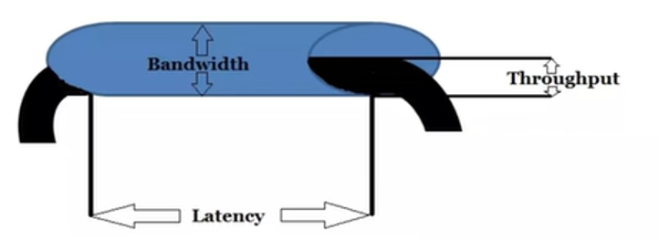

# GPU bandwidth

## bandwidth
```shell
GPU带宽 = 内存频率 * Prefetch * (内存位宽/8)
```

## picture


## Reference
1. [techpowerup](https://www.techpowerup.com/gpu-specs/)
2. [《GDDR6 vs DDR4 vs HBM2?为什么CPU还不用GDDR？异构内存的未来在哪里？》](https://zhuanlan.zhihu.com/p/83935084)
3. [带宽，传输速率，吞吐量三者之间的关系与区别](https://blog.csdn.net/qq_51302564/article/details/119491586)