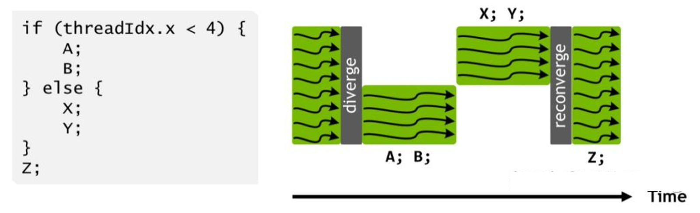
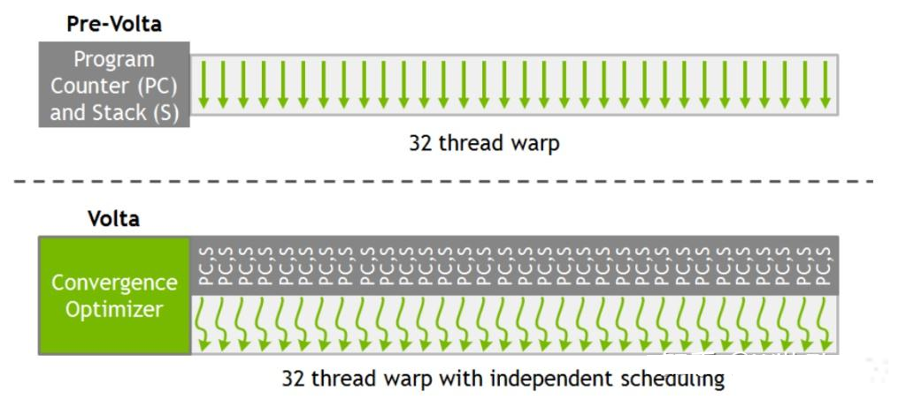
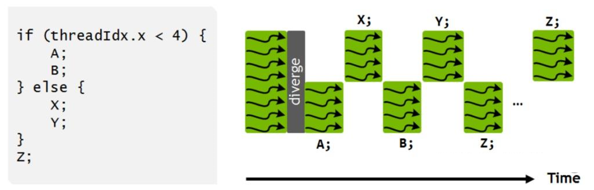
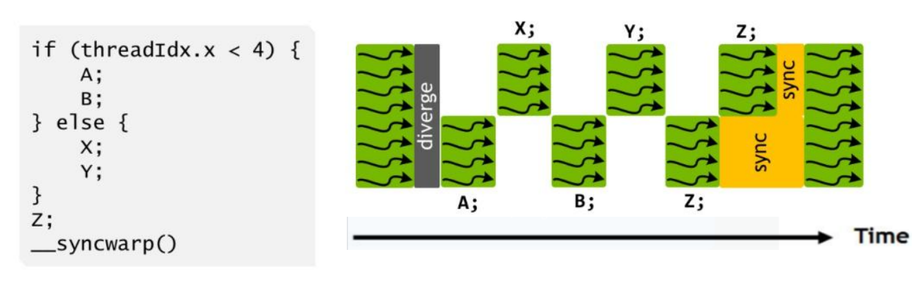

# Wrap Divergence
在一个wrap中，期望32个线程来做同一件事情，而尽可能不要出现分支。

## Introduction

从Volta开始，线程调度发生了变化，在Pascal以及之前的GPU上，每个Warp里的32个线程共享一个Program Counter (简称PC) ，并且使用一个Active Mask表示任意时刻哪些线程是可运行的，一个经典的运行如下:

直到第一个分支完整结束，才会执行另一个分支。这意味着同一个warp内不同分支失去了并发性，不同分支的线程互相无法发送信号或者交换数据，但同时，不同warp之间的线程又保留了并发性，这当中的线程并发存在着不一致，事实上如果程序员不注意这点，很可能导致死锁。

在Volta中解决了这个问题，同warp内的线程有独立的PC和栈，如下:

由于运行时仍然要符合SIMT，所以存在一个调度优化器负责将可运行的线程分组，使用SIMT模式执行。经典运行如下：

上图可以注意到，Z的执行并没有被合并，这是因为Z可能会产生一些被其他分支需要的数据，所以调度优化器只有在确定安全的情况下才会合并Z，所以上图Z未合并只是一种情况，一般来说，调度优化器足够聪明可以发现安全的合并。程序员也可以通过一个API来强制合并，如下:

## 参考
1. [《英伟达GPU架构演进近十年，从费米到安培》](https://zhuanlan.zhihu.com/p/413145211)
