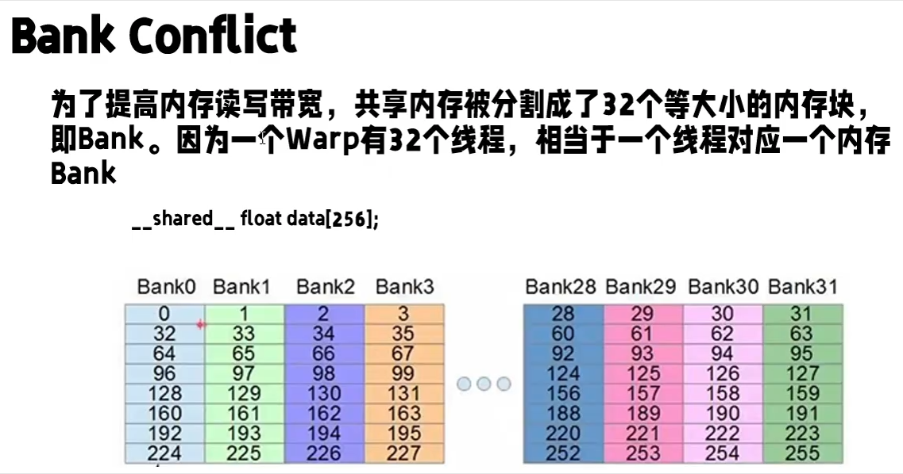
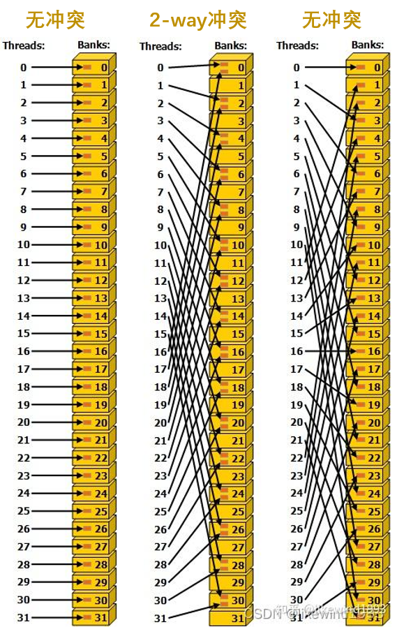

# Band Conflict

英伟达GPU上的shared_memory，会被映射到大小相等的32个Bank上. 每个BandSize的大小为4字节，而Bank实际大小是BankSize×层数，也就是这里的4 × 8 = 32 字节.

当一个wrap中的多个线程读写同一个Bank中的数据时，会由硬件把内存读写请求，拆分成 conflict-free requests，进行顺序读写，此为“Bank Conflict”.

## 参考
1. [《【CUDA编程概念】一、什么是bank conflict？》](https://zhuanlan.zhihu.com/p/659142274)