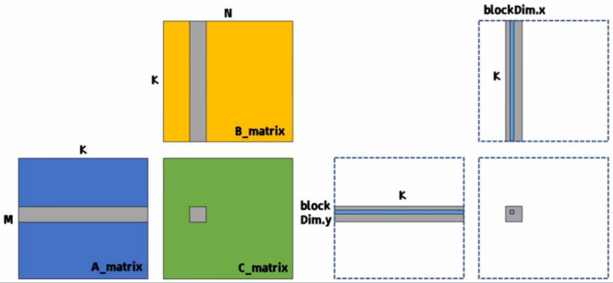

# SGEMM using global memory

## Description
对于矩阵A[M, K]、矩阵B[K, N]，求解矩阵相乘结果，即矩阵C[M, N]。


观察矩阵C，显然‘写出（Write）’计算量为 M x N 。        
计算矩阵C中的每一个元素，都需要分别从矩阵A、矩阵B读取K个元素，即‘2K’，那么‘读入（READ）’计算量为‘M x N x 2K’。

## Kernel
Kernel 程序如下：
```shell
__global__ void sgemm_cuda(float *A_ptr, float *B_ptr, float *C_ptr, const int M, const int N, const int K) {

      const int x = blockIdx.x * blockDim.x + threadIdx.x;
      const int y = blockIdx.y * blockDim.y + threadIdx.y;
      float *A_ptr_start = A_ptr + blockIdx.y * blockDim.y * K;
      float *B_ptr_start = B_ptr + blockIdx.x * blockDim.x;

      float sum = 0.0f;
      for (int k = 0; k < K; k++) {           
            sum += A_ptr_start[threadIdx.y * K + k] * B_ptr_start[threadIdx.x + k * N];
      }
      C_ptr[x + y * N] = sum;
}
```