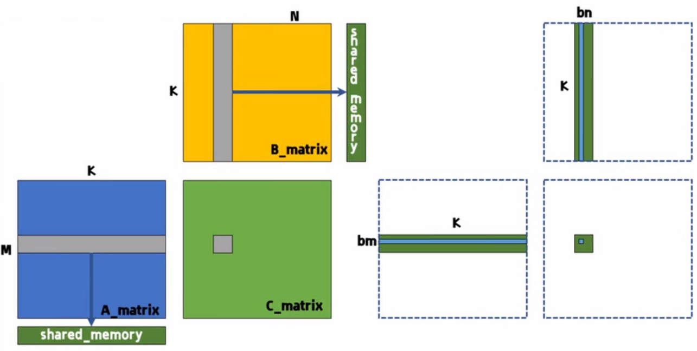

# SGEMM using shared memory
利用共享内存计算SGEMM

## Description
对于矩阵A[M, K]、矩阵B[K, N]，求解矩阵相乘结果，即矩阵C[M, N]。算法的示意图，如下图所示：

算法的核心思想：将灰色处的数据迁移至Shared_Memory, 从而加速load的时间。      
读取计算量：KNM（1/bn + 1/b/m）          
写入计算量：MN      